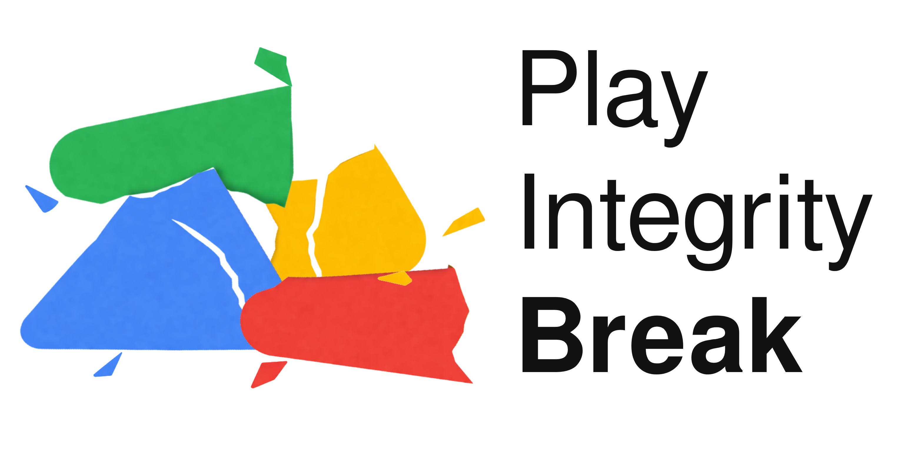

# Play Integrity Break



Fix Google Play Integrity... by BREAKING it!

## What does PIB do?

PIB is an Xposed module that logs, and optionally intercepts, Play Integrity service requests/responses activity per target app.

### Why do we want to do this? (Project vision)

#### 1. Have a more stable bypass for Play Integrity

##### The current situation

The current situation with modified Android devices is that:  
- You get your detection bypass setup, with susfs, xygisk next, HMA, Tricky Store and most importantly, an unrevoked keybox.  
- The keybox you use gets revoked and you start getting no integrity, without notice
- Your apps get a "no integrity" verdict and they stop working when you most need them.
- You have to find a new keybox, which is a both a pain and a limited and non-renewable resource, and re-login to all your apps.  

##### The idea: What if we fake errors?

From
[Google's guide on Play Integrity Errors](https://developer.android.com/google/play/integrity/error-codes):

> Use exponential backoff for Play Integrity operations that happen in the background and don't affect the user experience while the user is in session.
> ...
> If you continue to see errors after three retry attempts, treat the outcome as if the client has failed all integrity checks. 

What are we exploiting here is that many apps do not actually treat the failure as "no integrity", OR that they only require a single successful response during the first launch and/or during login.  

Why?  
Well, put yourself in the shoes of a bank. You want to use Play Integrity to protect your app, but you also don't want to lock out users when Google servers are down. So what do you do? You basically go down whenever Google goes down?  

In other words: Depending on your apps, you might only want to have a working PI with unrevoked keybox during your app's setup. After that, you don't need Play Integrity to work at all.  

#### 2. Reduce number of Play Integrity requests

Keyboxes are quickly revoked because they are used by thousands of users at the same time.  
Some apps use Play Integrity APIs improperly, increasing usage unnecessarely.  
By intercepting requests, PIB can reduce the number of requests sent to the Play Integrity service, which should make keyboxes last longer.   

#### 3. Study app's usage of Play Integrity at scale

This app includes optional opt-in telemetry that sends anonymized data about Play Integrity usage to a central server.  
This data can be used to understand how apps use Play Integrity.  
The long-term goal is to create and maintain a database of apps and their Play Integrity usage patterns.  

## What does PIB NOT do?

PIB does NOT help you to:

- Hide root and modifications
- Get a working Keybox
- Help you get a BASIC, DEVICE or STRONG verdict.
- Get apps that always want a working Play Integrity to work.  

PIB starts with the assumption that you already have a working root hiding mechanism, and that you get a DEVICE verdict (at least for setup time).  

## Telemetry ??

The idea is to get a larger picture of how apps use Play Integrity, and to be able to share this information with the community.  
This is an optional feature, disabled by default.  

### Privacy policy (what do I receive)

- Your IP address: I have to receive it because that's how the internet works. I do not log it, store it, or use it in any way.
- Your user ID: This is a random UUID generated by the app on first launch. It is used to separate data from different users. This should enable us to distinguish between setup-level events and regular usage events, which is important for the project vision. I'm not able to link this ID to any real identity.  
- Your app's package name: The package name of the apps installed in your phone asking for Play Integrity.
- Play Integrity version: The version of the Play Integrity library used by the app.  

### How is it used

This data is only used to get statistics and patterns of how apps use Play Integrity.  
The insights coming from these statistics (e.g. X only needs PI during setup) will build a database of apps and their Play Integrity usage patterns, which will be shared with the community.  
The data will not be shared with any third party, and will not be used for any other purpose than the one described above.  
Data will be retented as long as they are useful (a few years?)

#### Data deletion

Contact me with your user ID and I will delete all data associated with it.  

## How to correct the weaknesses that PIB exploits?

### 1. Google: Authenticate errors

This project exploits the fact that Play Integrity errors are not authenticated at all. This makes sense for a few errors (unreachable network, internal error...), but some errors (rate limit, server reachable but unhealthy...) could be authenticated (maybe with a different set of generic keys).

### 2. Developers: Treat errors as "no integrity"

As Google says, implement PI correctly and treat errors as "no integrity".  
Log out users when you get an error.  
You chose to lock-in to Google, deal with the consequences.  
Maybe you can not use it and let us live in peace?  

## Build with Nix

PIB ships a repo-local Nix development shell for reproducible Android builds.

1. Enter the shell:

```bash
nix develop
```

2. Build all modules:

```bash
nix develop -c ./gradlew :common:assembleDebug :xposed:assembleDebug :app:assembleDebug --no-daemon
```

The shell uses Android SDK components from nixpkgs by default and only falls back to a host SDK when the required platform/build-tools are already present.

## AI Policy

This project has been vibe coded.  
I didn't read the code at all (and I don't have Kotlin android skills). It is probably badly written.  
I hate delivering unpolished things, but for this project I made an exception.  
Having said that, it seems to work. So... yeah.  

## Fork

This project is a fork of frknkrc44/HMA-OSS , which is a very good project.  
Thank you frknkrc44 and contributors!    
This is why this project is working nicely: It has a solid base.  

### Translation

Thanks to Crowdin contributors for the original project!